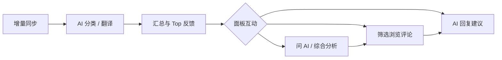
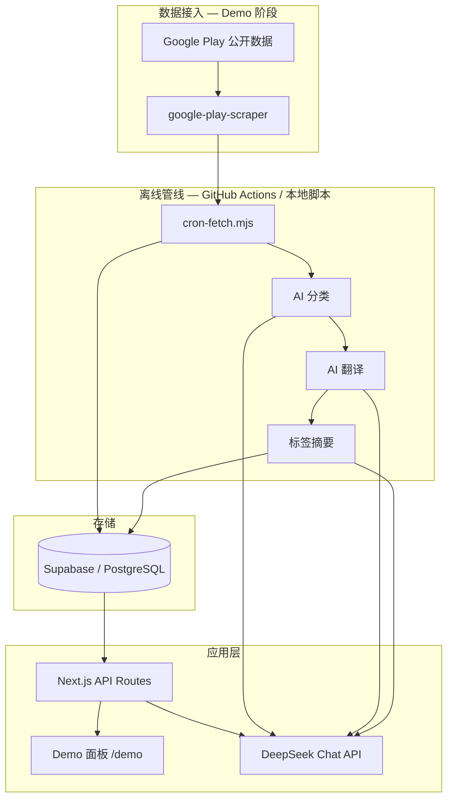

# 呼声雷达

> AI 驱动的应用商店评论**工作流**——覆盖「监控 → 理解 → 互动」全链路：把多语言、海量用户评论变成可筛选、可汇总、可追问的产品洞察，并在一处完成 AI 辅助回复与多轮问答。

**在线 Demo**：[hushengradar.com/demo](https://hushengradar.com/demo)  
**落地页**：[hushengradar.com](https://hushengradar.com)

个人全栈项目：围绕评论处理工作流，从增量同步、AI 结构化、统计聚合，到面板上的筛选分析、问 AI、回复建议，端到端设计与实现。

---

## 背景与目标

应用商店评论是产品迭代的一手信号，但现实里往往：

- 评论量大、语言杂，人工翻看不现实
- 笼统抱怨和具体问题混在一起，难以定位 Top 问题
- 产品/运营临时想问「最近版本口碑怎么样」「阿拉伯语用户在骂什么」，缺少统一分析入口
- 看完洞察还要切回商店逐条回复，**理解与行动割裂**

**呼声雷达**把评论处理做成一条连贯工作流，而不是只做静态报表：

**同步 → 结构化 → 洞察 → 互动**——离线管线负责增量抓取与 AI 批处理；Demo 面板承接日常操作：按问题筛选评论、看图谱、问 AI、为单条评论生成回复草稿（可按用户原语言），把「看懂」和「回应」放在同一界面。

---

## 核心工作流

| 阶段 | 做什么 | Demo 中的体现 |
|---|---|---|
| **监控** | 按 locale 增量拉取新评论，落库去重 | 定时 cron + 水位线 |
| **理解** | 打标签、翻译、生成标签摘要 | 离线 AI 管线 |
| **洞察** | 看分布、下钻子问题、按版本/地区/时间筛选 | Top 反馈、统计图、insights |
| **互动** | 围绕评论与数据追问、起草回复 | 问 AI（流式多轮）、单条 AI 回复建议、术语表统一译法 |

当前 Demo **互动层**以辅助决策为主（生成回复草稿、对话式分析）；经官方 API **一键回帖到商店**列入演进方向，工作流闭环在设计时已预留。

---

## 产品形态

目标交付两种形态，共用同一套工作流与 AI 分析层：

| 形态 | 面向 | 说明 |
|---|---|---|
| **SaaS** | 中小团队、希望快速接入 | 多租户托管部署；客户通过控制台授权商店账号，按需开通 App，免运维数据库与定时任务 |
| **私有化部署** | 对数据驻留、合规或内网有要求的客户 | 整套服务部署在客户自有环境（或指定云）；评论与 AI 处理数据不出域，商店凭证由客户自行保管 |

Demo 当前为 **单租户展示环境**（自托管 Supabase + Cloudflare），用于验证工作流与面板体验；产品化时将补齐租户隔离、商店授权与按形态裁剪的运维面。

---

## Demo 里能体验什么

### 已实现

| 能力 | 说明 |
|---|---|
| 评论浏览与筛选 | 按标签、子标签、评分、地区、时间、关键词、是否已回复筛选 |
| Top 反馈聚合 | 顶层问题分布 + 有效子标签下钻；好评 / 笼统抱怨走独立展示规则 |
| 统计图表 | 评分分布、版本/地区维度、标签占比等 |
| 多语言翻译 | 评论自动翻译为中文/英文集中查看 |
| AI 综合分析 | 基于当前筛选范围生成结构化洞察 |
| 问 AI | 流式问答，结合聚合统计与样本评论；支持多轮上下文 |
| **评论回复工作流** | 在面板内选中评论 → AI 生成回复草稿（可带入 App 背景、术语表、补充说明）→ 按用户原语言输出，便于复制到商店后台 |
| 术语表 | Per-App 产品专名维护，分类与回复时统一译法 |
| 定时增量同步 | GitHub Actions 每日跑抓取 → 分类 → 翻译 → 摘要 |

### 部分实现 / 规划中

| 项 | 状态 |
|---|---|
| Google Play 数据 | ✅ Demo 已打通（见下方「当前技术栈」） |
| App Store 数据 | UI 已预留；数据管线尚未接入 |
| 官方商店 API 接入 | 产品方向，替换当前 Demo 抓取层（见「演进方向」） |
| 落地页中的一键回复发送、周报、预警等 | 产品愿景；Demo 已覆盖回复**起草**与数据分析互动，尚未直连商店回帖 |

---

## 技术要点

这个项目难的不在「接几个 API」，而在于：**真实评论又杂又长、量又大，LLM 上下文装不下全文，单次分类又不可靠**。下面是围绕这些约束做的几处设计——每条都可在 [Demo](https://hushengradar.com/demo) 里直接验证。

### 分类时先抽「跟这个问题有关的那句话」

一条评论常同时骂好几件事。分类不只打标签，还为每个标签留下**与该标签对应的摘录**（去掉无关内容）。  
之后无论是 Top 反馈、问 AI、还是回复建议，都复用这份「轻量索引」——同样大小的上下文里，能覆盖远比「整段评论原文」更多的样本。多语言长评也不会把模型撑爆。

→ **Demo**：点开任意评论看标签旁摘录；在「问 AI」里问「最近用户在抱怨什么」——回答基于大量摘录归纳，而非随便挑几条全文。

### 分类不靠「问一次就信」

每个 App 有自己的问题分类表（从真实评论长出来，可修订）。单条评论走**多轮判定**：先分、再校验、语义不对再校准，必要时区分「原因」和「发泄后果」。  
代码规则与模型校准分工——不堆关键词表硬路由，也不迷信第一次输出。

→ **Demo**：看 Top 反馈的子问题下钻是否说得通；切换筛选条件后，问 AI 的条数与列表是否一致。

### 问 AI 按问题换检索方式，且不许瞎编

面板里的问答不是把数据库扔给模型。模型按需取数：要数数用统计，要懂「用户在说什么」则**先对筛选范围内全部摘录做主题归纳，再补少量代表引用**——禁止用几条抽样代替整体。  
同时写死证据边界：只能说工具查到的数字和原文，推测要标明依据；「最近一周」锚定在该 App **最新一条评论的日期**，避免商店索引延迟造成假象。

→ **Demo**：先筛一个标签或时间范围，再问「这类问题主要是什么」「有多少条」——看数字是否与列表吻合，归纳是否贴摘录。

### 标签体系会长大，展示跟着长

分类表允许冷启动不完美，运行中可修订并批量重判。展示层与分类共用一套规矩：子问题够多就下钻，不够就用摘要兜底，不让界面硬凑标签 chip。  
分析、展示、重判是同一套演进闭环，而不是上线时定死一张表。

→ **Demo**：对比 Top 反馈里「能下钻」与「走摘要」的类别；术语表修改后，回复建议的译法是否一致。

---

## 架构（当前 Demo）

**分工**：重计算在 cron 离线完成；面板承接工作流后半段——查询、聚合、问 AI、回复起草（insights / ai-reply / ask）。

---

## 当前技术栈（Demo 真实使用）

| 层 | 技术 | 说明 |
|---|---|---|
| 前端 | Next.js 16、React 19、Tailwind CSS 4 | App Router；`/demo` 为分析面板 |
| 后端 | Next.js Route Handlers | REST 风格 Demo API |
| 数据库 | Supabase（PostgreSQL） | Service Role；含 RPC 聚合与迁移脚本 |
| AI | DeepSeek Chat（`deepseek-chat`） | 分类、翻译、摘要、insights、问答、回复建议 |
| 评论数据（Demo） | `google-play-scraper` | 公开页增量抓取；**非** Google Play Developer API |
| 部署 | OpenNext + Cloudflare Workers | 自定义域名见 `wrangler.jsonc` |
| 定时任务 | GitHub Actions | 每日 UTC 02:00 跑 `scripts/cron-fetch.mjs` |
| 图表 | Recharts | Demo 统计可视化 |

---

## 演进方向（产品化，非当前 Demo 实现）

Demo 优先验证 **「AI + 分析 + 互动」工作流** 的价值；正式产品计划在数据接入与回帖环节升级为官方渠道。

### 商店官方接入（与当前 Demo 抓取方式不同）

| 平台 | 接入方式 | 凭证与前置条件 |
|---|---|---|
| **Google Play** | [Google Play Developer API](https://developers.google.com/android-publisher)（Android Publisher API） | 需 **Google Cloud 项目** + **Service Account**（JSON 密钥）；在 Play 管理中心 → API 访问 中关联该服务账号并授予应用权限。用于拉取评论、发布回复等，**不是** Demo 现用的公开页抓取 |
| **App Store** | [App Store Connect API](https://developer.apple.com/app-store-connect/api/) | 需 App Store Connect API 密钥（Issuer ID、Key ID、私钥 `.p8`）；schema 与 UI 已预留，数据管线待实现 |

客户侧凭证由租户自行创建与授权：**SaaS** 模式下经 OAuth / 上传密钥等方式安全托管；**私有化部署** 下凭证仅保存在客户环境内。

### 其他产品化项

| 方向 | 说明 |
|---|---|
| 鉴权与多租户 | 按客户 / App 隔离数据与配置 |
| 通知与周报 | 落地页描述的主动推送能力 |
| 商店回帖闭环 | 面板内起草 → 经官方 API 一键发布回复 |

**架构意图**：抓取与回帖层可插拔；分类、统计、面板互动按长期工作流形态设计，Demo 已覆盖从同步到回复起草的主链路。

---

## 许可

All rights reserved.
