# 呼声雷达

> 应用商店评论工作流，覆盖监控、理解、互动。多语言评论可筛可汇总、可问 AI，选中评论后还可在回复栏里起草回帖。

**在线 Demo**：[hushengradar.com/demo](https://hushengradar.com/demo)  
**落地页**：[hushengradar.com](https://hushengradar.com)

---

## 背景与目标

商店评论对产品迭代很重要，但实际用起来很麻烦：

- 量大、语言混杂，人工翻不过来
- 无具体反馈的纯抱怨和具体问题反馈搅在一起，很难看出 Top 问题
- 临时想问最近版本怎么样、某国用户在骂什么，没有统一入口
- 看完分析还得回应用商店后台一条条回

呼声雷达把整条链路串起来，不做死报表：

**同步 → 结构化 → 洞察 → 互动**。重活放离线管线（增量抓取 + AI 批处理）；日常操作在 Demo 面板：按问题筛评论、看图谱、问 AI、给单条评论出回复草稿（可按用户原语言），看懂和回复不用来回切工具。

---

## 产品形态

规划两种交付方式，底层同一套分析和 AI 逻辑：

| 形态        | 适合谁                          |
| --------- | ---------------------------- |
| **SaaS**  | 中小团队、希望开箱即用；商店账号授权接入，凭证由平台托管 |
| **私有化部署** | 需要数据留在自己环境，商店凭证客户自持          |

---

## 通用性与可定制的工作流

- 一套通用工作流服务任意 App：`add-app` 接入即可，标签从评论归纳、自动演进。
- 可定制项：

| 可定制项                   | 作用                   |
| ---------------------- | -------------------- |
| `context`              | 产品背景，注入分类、翻译、问 AI、回复 |
| `terminology_glossary` | 专名映射，翻译与 AI 输出不意译    |
| `taxonomy_meta.policy` | taxonomy 修订门槛、是否自动重判 |
| 回复语气 / 联系方式            | 回复建议（与问 AI 无关）       |

- AI 自动化：
  - 评论量大、没法人工逐条看 → cron 每日自动跑抓取、分类、翻译、标签摘要；taxonomy 按信号 enrich / 修订 / 重判
  - 体系大改可能误伤历史标注 → 破坏性变更进 `pending_reclassify`，确认后再 `reclassify-app`；`remap` 小改确定性落库
  - 临时想问、要写回复 → 面板问 AI、洞察、回复建议按需调用（不属自动化链路）

---

## 评论分类与子分类

- 一条评论常同时说好几件事，整段塞进模型又贵又乱 → 初判时为每个标签抽 evidence；`classifyReviewWithPipeline` 经结构校验、可疑才语义校准、原因后果专检后落库
- taxonomy 未成熟、子标签不够 → 母类满 2 个有效 sub 才强制 subKey；Top 反馈不够 chip 门槛时用摘要兜底，不硬凑（`praise` / `vague_complaint` 永不 breakdown）
- 冷启动噪声（临场造 sub、单批偶发） → 复用池须命中 ≥5 次且排除 `general`；taxonomy 修订看过命中量与跨天沉淀；低命中 ephemeral sub 清零重标
- 说不清该归哪个 sub → 暂归「其他」；满 20 条且过 3 天冷却才从 evidence enrich 新 sub 并重读原评论；滥用「其他」触发语义校准

源文件 <a href="docs/diagrams/classification.mmd">classification.mmd</a> · 修改后运行 <code>npm run diagrams</code> 重新导出

---

## 问 AI（askTools）

- 评论库塞不进 context → 不灌全库，通过 `get_stats` / `count_reviews` / `summarize_reviews` / `query_reviews` 按需取证
- 抽几条样本容易以偏概全 → 要主题先对 scope 内 evidence 全量归纳，超 1600 条 map-reduce 合并，再 `query_reviews` 补少量引用
- 「最近一周」锚服务器今天，窗口尾部会空 → 相对时间锚该 App `latestReviewDate`，与 Demo 列表同口径
- 归纳样本数被误当成评论总数 → `askCountPrefetch` 预取统计；作答只报 `total`，不用 `evidenceUsed` 代替

源文件 <a href="docs/diagrams/ask-tools.mmd">ask-tools.mmd</a>

---

## 架构（当前 Demo）

源文件 <a href="docs/diagrams/architecture.mmd">architecture.mmd</a>

离线主链路：抓取 → 分类（含 taxonomy 演进与按需重判）→ 翻译 → 标签摘要；重活放 cron，面板以查库为主，问 AI / 回复 / 洞察等按需调 DeepSeek。分类、校准、翻译、摘要、问 AI、回复等 prompt 集中在 `promptKit`，cron 与面板 API 共用。前端 Next.js / React / Tailwind；部署 OpenNext + Cloudflare Workers。

---

## 演进方向（产品化，非当前 Demo）

Demo 先验证 AI 分析 + 互动这条工作流；正式版会在接数据和回帖上换成官方渠道。

### 商店官方接入（和 Demo 抓取不是一回事）

| 平台              | 接入方式                                                                         | 凭证                                                                                  |
| --------------- | ---------------------------------------------------------------------------- | ----------------------------------------------------------------------------------- |
| **Google Play** | [Google Play Developer API](https://developers.google.com/android-publisher) | Google Cloud 项目 + Service Account（JSON）；Play 管理中心里关联并授权。用来拉评论、发回复，不是现在 Demo 用的公开页抓取 |
| **App Store**   | [App Store Connect API](https://developer.apple.com/app-store-connect/api/)  | Issuer ID、Key ID、`.p8` 私钥；库表和 UI 预留了，管线还没写                                          |

两种形态下商店凭证都由客户创建并授权：SaaS 下由平台安全托管，私有化部署下只在客户环境里。

### 其他

| 方向     | 说明                |
| ------ | ----------------- |
| 鉴权与多租户 | 按客户 / App 隔离      |
| 通知与周报  | 落地页里说的那些主动推送      |
| 商店回帖   | 面板起草 → 官方 API 直接发 |

抓取和回帖层可以换；分类、统计、面板互动按长期产品来设计，Demo 已经跑通从同步到出回复草稿这条主链路。

---

## 许可

All rights reserved.