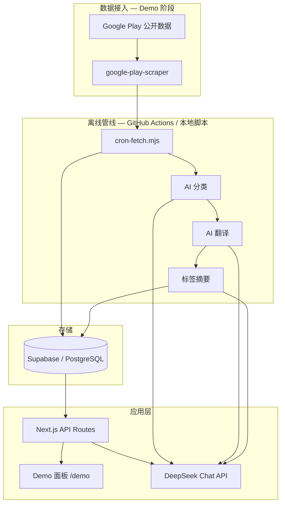

# 呼声雷达

> 应用商店评论工作流，覆盖监控、理解、互动。多语言评论可筛可汇总、可问 AI，选中评论后还可在回复栏里起草回帖。

**在线 Demo**：[hushengradar.com/demo](https://hushengradar.com/demo)  
**落地页**：[hushengradar.com](https://hushengradar.com)

---

## 背景与目标

商店评论对产品迭代很重要，但实际用起来很麻烦：

- 量大、语言混杂，人工翻不过来
- 无具体反馈的纯抱怨和具体问题反馈搅在一起，很难看出 Top 问题
- 临时想问最近版本怎么样、某国用户在骂什么，没有统一入口
- 看完分析还得回应用商店后台一条条回

呼声雷达把整条链路串起来，不做死报表：

**同步 → 结构化 → 洞察 → 互动**。重活放离线管线（增量抓取 + AI 批处理）；日常操作在 Demo 面板：按问题筛评论、看图谱、问 AI、给单条评论出回复草稿（可按用户原语言），看懂和回复不用来回切工具。

---

## 产品形态

规划两种交付方式，底层同一套分析和 AI 逻辑：

| 形态 | 适合谁 |
|---|---|
| **SaaS** | 中小团队、希望开箱即用；商店账号授权接入，凭证由平台托管 |
| **私有化部署** | 需要数据留在自己环境，商店凭证客户自持 |

---

## 技术要点

### 1️⃣ 通用工作流，不是单 App 硬编码

Per-App 配置 · 接入层可换 · 标签从评论长出来 · 术语表与回复 context 可自定义

若按单款 App 写死规则，换客户就要改代码。每家 App 单独维护背景、标签表、抓取地区、术语表和回复补充说明；接入新 App 时用 listing 脚本从商店信息起步。Demo 用公开抓取跑通管线，换 Google Play / App Store 官方 API 时只替换接入层。

### 2️⃣ 分类与标签体系

多阶段分类 · 分类时抽摘录 · 语义校准 · 可批量重判 · 子标签不够不硬凑

一条评论常同时说多件事，整段评论又占满 context。分类时为每个标签留下相关摘录，统计、问 AI、写回复都走这份索引；单条经初判、校验、校准才定稿，标签表从真实评论归纳、可修订并批量重跑。子标签不够多时界面用摘要，不硬凑子标签。

### 3️⃣ Prompt 设计

单源维护 · 离线与面板同口径 · 证据边界 · 冷启动容忍噪声

分类、校准、摘要、问 AI、回复建议的 prompt 集中维护，离线脚本与面板 API 共用，避免两套口径。冷启动阶段标签表尚未完备：说不清具体点的先归笼统抱怨或好评，不逼每条立刻拆到位；体系成熟后再收紧规则并批量重跑。

### 4️⃣ LLM context 与问 AI

摘录优先于全文 · 工具按需取证 · 先归纳后引用 · 时间锚到最新评论日

评论量大，无法把整库塞进模型。问 AI 通过工具按需取数：要数用统计接口，要问用户到底在抱怨什么，则先对筛选范围内全部摘录做主题归纳（超量时分批再合并），再补少量代表引用。相对时间（如最近一周）以该 App 最新评论日为锚，计数与 Demo 列表一致。

---

## 架构（当前 Demo）

重的算力放 cron 离线跑；面板负责查、聚合、问 AI、出回复草稿。前端 Next.js / React / Tailwind；部署 OpenNext + Cloudflare Workers；Demo 评论抓取走公开页，非 Google Play 官方 API。

---

## 演进方向（产品化，非当前 Demo）

Demo 先验证 AI 分析 + 互动这条工作流；正式版会在接数据和回帖上换成官方渠道。

### 商店官方接入（和 Demo 抓取不是一回事）

| 平台 | 接入方式 | 凭证 |
|---|---|---|
| **Google Play** | [Google Play Developer API](https://developers.google.com/android-publisher) | Google Cloud 项目 + Service Account（JSON）；Play 管理中心里关联并授权。用来拉评论、发回复，不是现在 Demo 用的公开页抓取 |
| **App Store** | [App Store Connect API](https://developer.apple.com/app-store-connect/api/) | Issuer ID、Key ID、`.p8` 私钥；库表和 UI 预留了，管线还没写 |

两种形态下商店凭证都由客户创建并授权：SaaS 下由平台安全托管，私有化部署下只在客户环境里。

### 其他

| 方向 | 说明 |
|---|---|
| 鉴权与多租户 | 按客户 / App 隔离 |
| 通知与周报 | 落地页里说的那些主动推送 |
| 商店回帖 | 面板起草 → 官方 API 直接发 |

抓取和回帖层可以换；分类、统计、面板互动按长期产品来设计，Demo 已经跑通从同步到出回复草稿这条主链路。

---

## 许可

All rights reserved.
